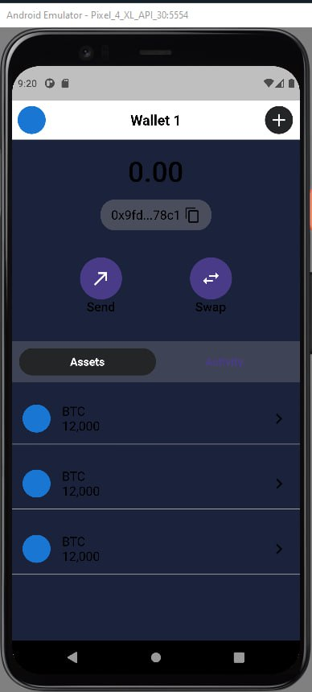
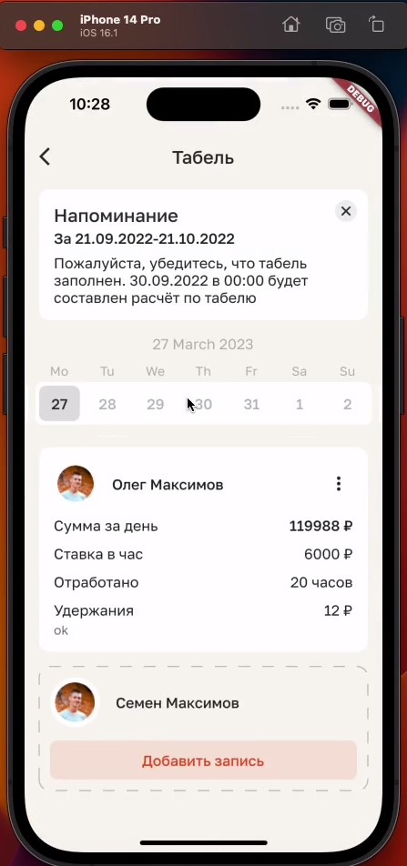
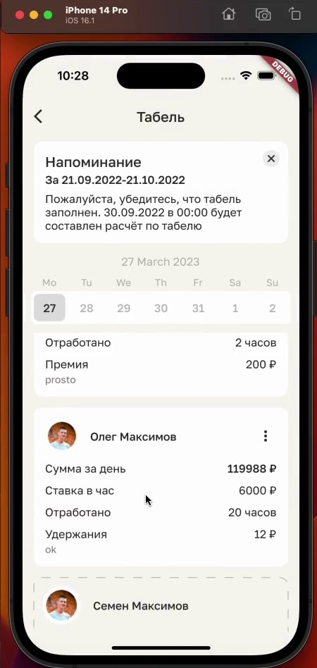
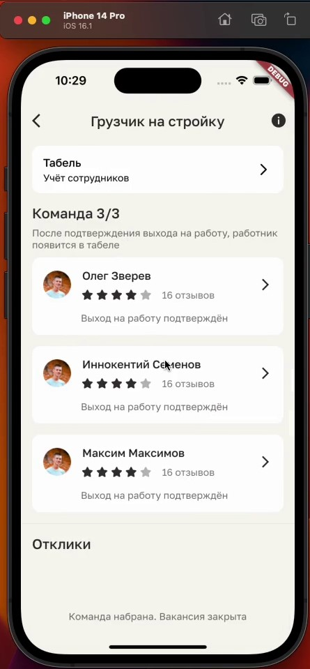
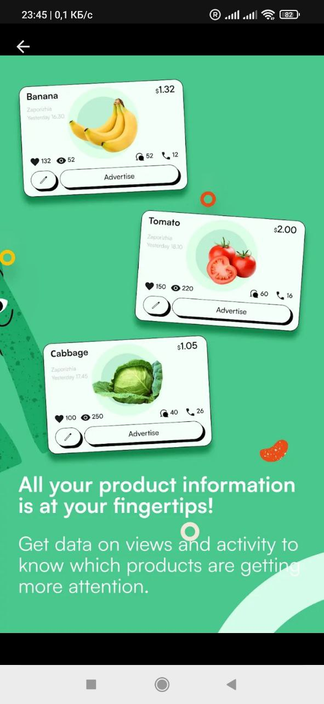
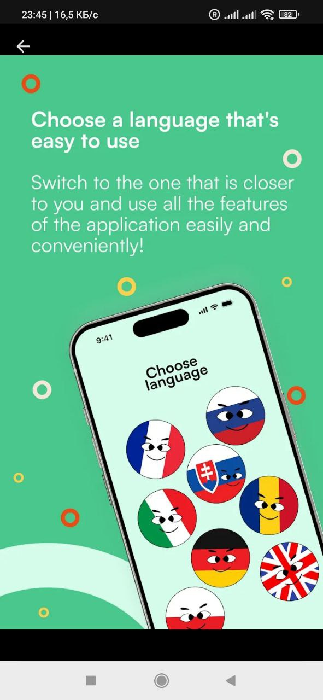

# Flutter Разработчик с 3-летним опытом

📍 Шри-Ланка  
🇧🇾  Беларусь  
✉️ borisukrusaln12345@gmail.com  
📞 Viber: +375 (25) 5350547  
📞 WhatsApp, Telegram: @flutterruslan  

## Навыки

**Языки:** Dart, Kotlin, Java, TypeScript  
**Фреймворки:** Flutter, Riverpod, BLoC, Freezed  
**Бэкенд:** Serverpod, PostgreSQL, Firebase, Node.js  
**Инструменты:** Dio, REST API, Docker, CI/CD, Git, GraphQL  
**Дополнительно:** web3dart, ankr, Onesignal, WebSockets, gRPC  

## Опыт работы

### forYou Inc (Август 2024 — Февраль 2025, 7 месяцев)  
**Flutter Developer**  
Разработал мобильное приложение маркетплейс с нуля под руководством тимлида. Проект запущен и завершен.

### Gybernaty Community (DTO) (Декабрь 2023 — Май 2024, 6 месяцев)  
[gyber.org](https://gyber.org)  
**Flutter Developer**  
Участвовал в разработке и запуске стартапа, связанного с созданием криптокошельков (кастодиальных и некостодиальных). Использовал Flutter, Serverpod и BLoC для клиентской и серверной частей.

### Freelance (Август 2023 — Февраль 2024, 7 месяцев)  
**Flutter Developer**  
Разрабатывал небольшие приложения и игры, интегрировал CI/CD, получил базовые знания Kotlin и Java.

### РАБОТНИК24 (Сентябрь 2022 — Сентябрь 2023, 1 год 1 месяц)  
**Flutter Developer**  
Работал над крупным проектом с использованием Clean Architecture, BLoC, Freezed, Dio и Firebase под руководством опытного тимлида.

### SFERA (Май 2022 — Сентябрь 2022, 5 месяцев)  
**Стажировка**  
Получил базовые знания и навыки работы с Flutter и смежными технологиями, участвовал в разработке приложения "SFERA".

## Образование

**2013** Институт современных знаний имени А.М. Широкова, Минск

## Проекты

### Gyber Wallet  
  
  
  
  
  
  

### Rabotnik  
  
  
  
  
  
  
  
  

### Agrotook  
  
  
  
  
  
  
  

### Kerla  
  
  
  
  
  

### SFERA  
  

## О себе
Специализируюсь на создании кроссплатформенных приложений на Flutter/Dart. Опыт работы с архитектурами BLoC и Riverpod, интеграцией API, настройкой CI/CD и развертыванием проектов на продакшен.
