# 📌 Борисюк Руслан | Flutter Разработчик с 3-летним опытом

<table>
  <tr>
    <td valign="top">
      📍 Шри-Ланка 🇱🇰 
      🇧🇾  Беларусь 
      ✉️ borisukrusaln12345@gmail.com 
      📞 Viber: +375 (25) 5350547 
      📞 WhatsApp, Telegram: <a href="https://t.me/flutterruslan">@flutterruslan</a>
    </td>
    <td valign="top" align="right">
      
    </td>
  </tr>
</table>

## 🛠️ Навыки

Специализируюсь на создании кроссплатформенных приложений на Flutter/Dart.  

- **Основные технологии:** Flutter, Dart, BLoC, Riverpod, Freezed  
- **Бэкенд:** Serverpod, PostgreSQL, Firebase  
- **Сетевые запросы:** Dio, REST API, WebSockets, gRPC  
- **DevOps:** Docker, CI/CD, Git  
- **Дополнительно:** web3dart, ankr, Onesignal  

---

## 🚀 Проекты

### Agrotook – Платформа для агро-бизнеса

  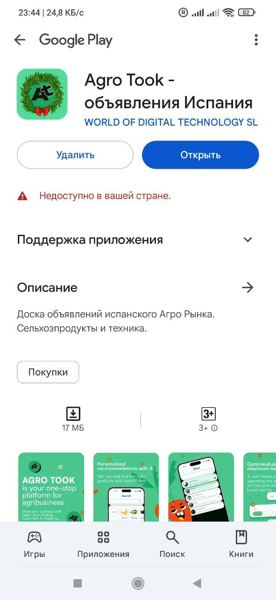 
  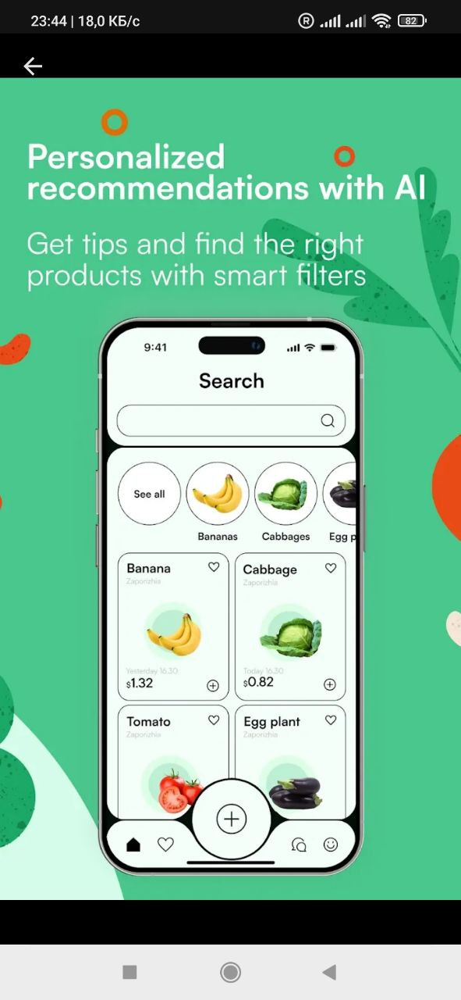 
  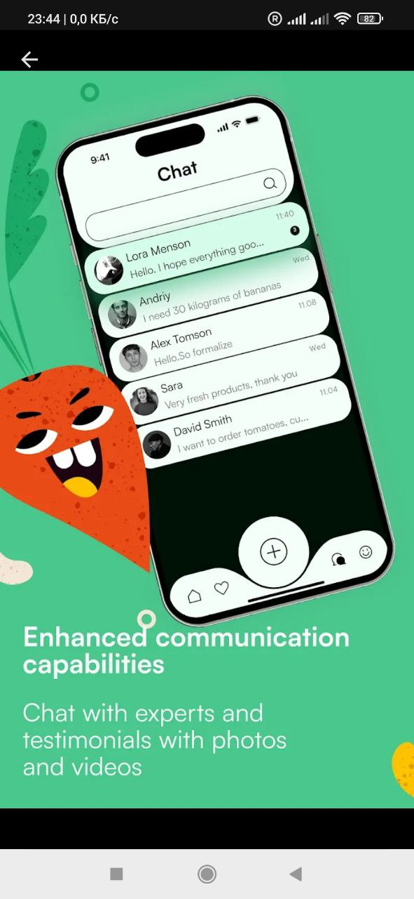 
  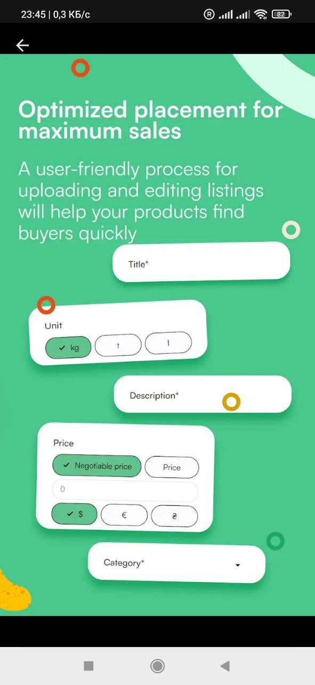 
  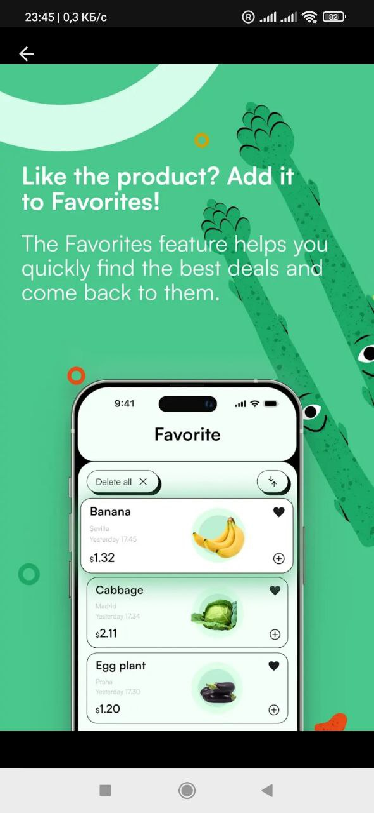

**Описание:** Разработал мобильное приложение-маркетплейс с нуля под руководством тимлида. Проект успешно запущен и завершен.  

---

### Kerla – Финансовый инструмент

  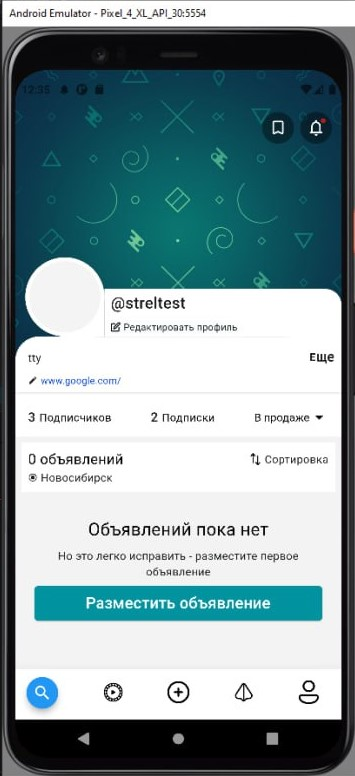 
  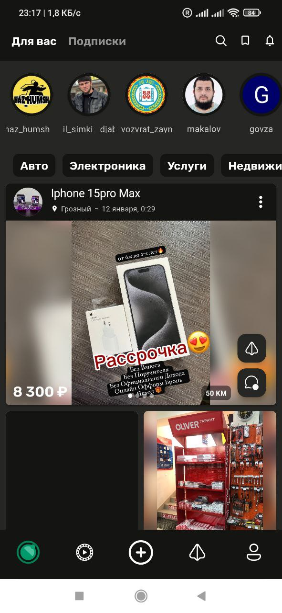 
  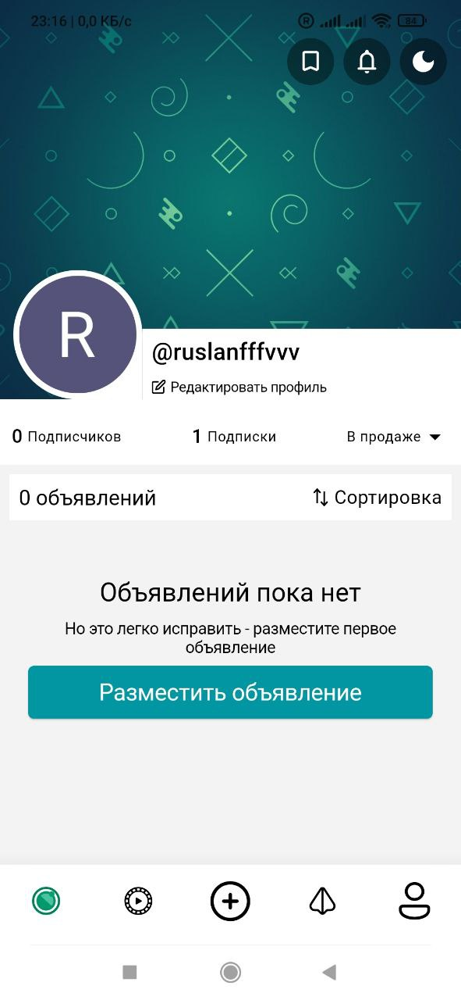 
  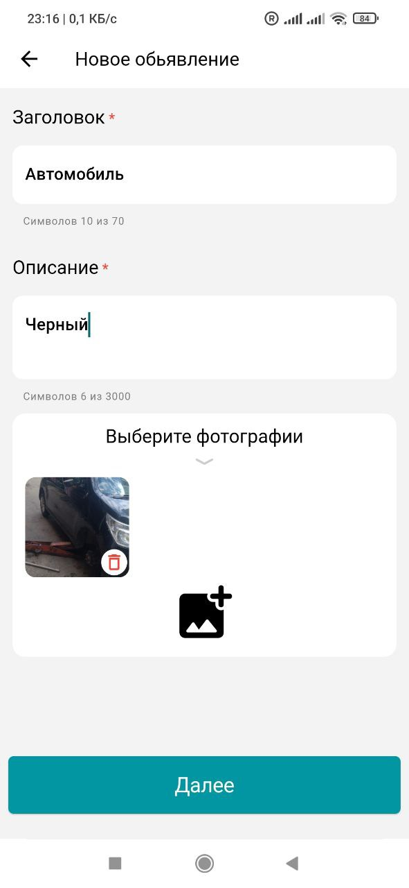 
  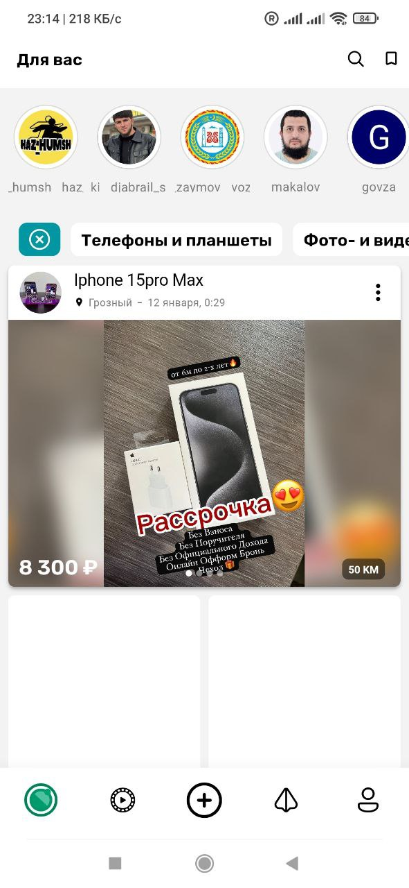

**Описание:** Финансовый инструмент для управления счетами и транзакциями. Использованы Firebase и PostgreSQL.

---

### Работник24 – Биржа фриланса

  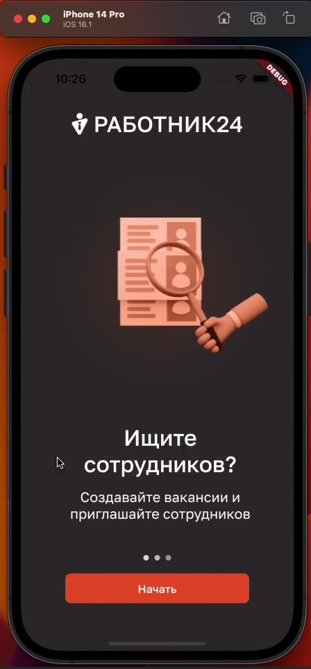 
  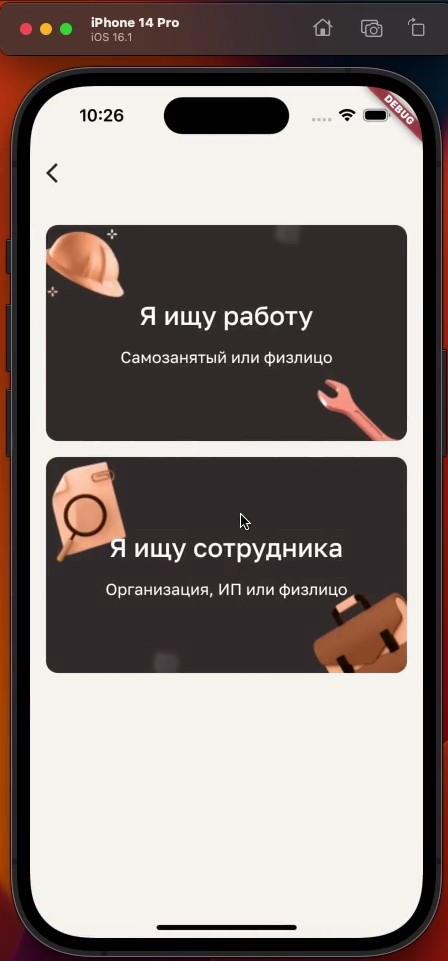 
  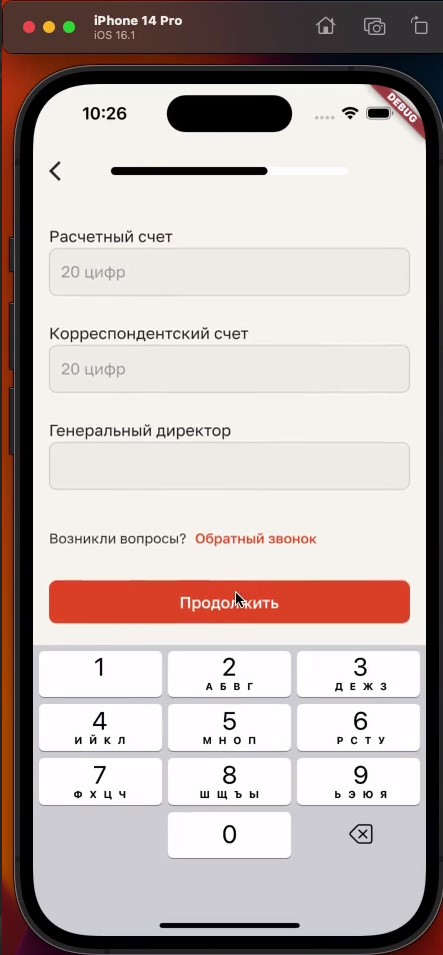 
  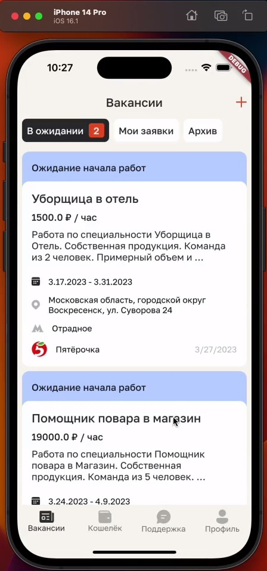 
  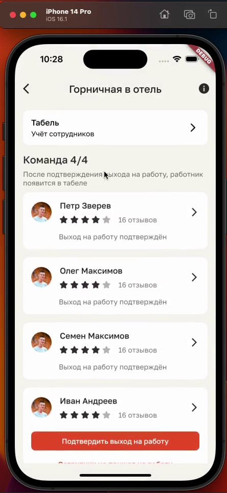

**Описание:** Участвовал в разработке крупного проекта с использованием Clean Architecture, BLoC, Freezed, Dio и Firebase.

---

### Gyber – Крипто-кошелек

  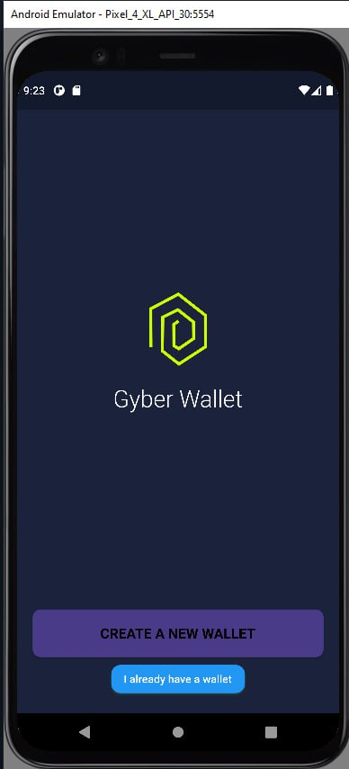 
  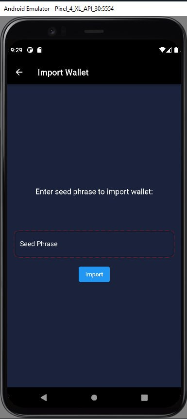 
  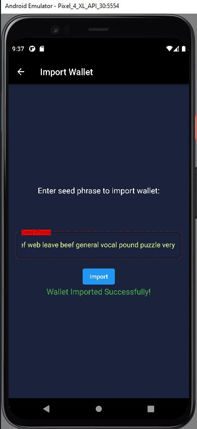 
  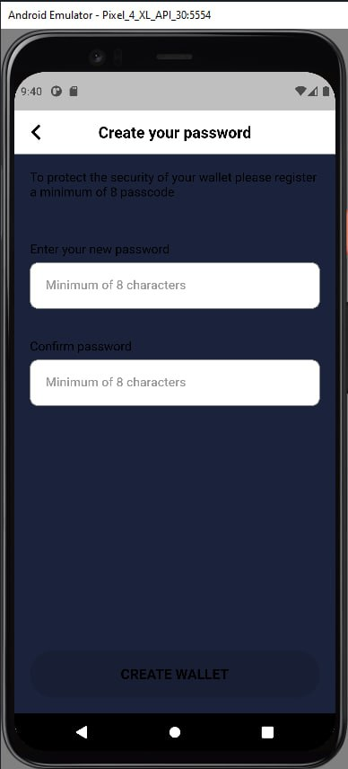 
  

**Описание:** Разработка крипто-кошелька с кастодиальными и некостодиальными хранилищами. Использованы Flutter, Serverpod и BLoC.

---

### SFERA – Социальная платформа

  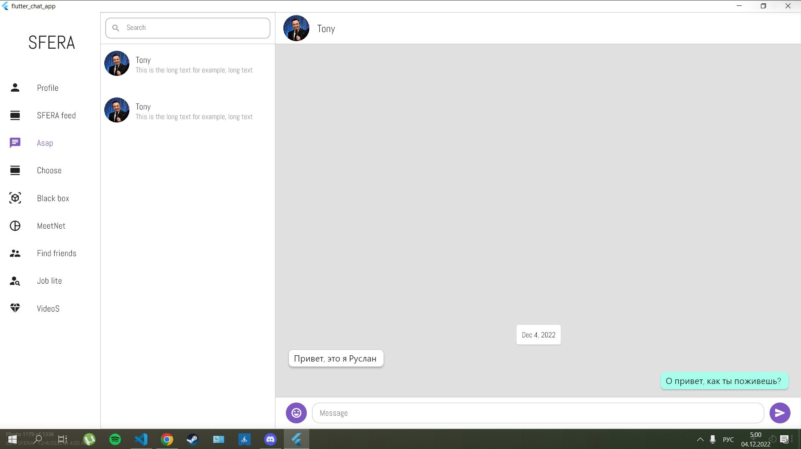  

**Описание:
